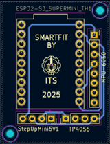
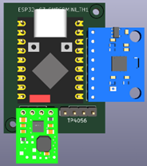
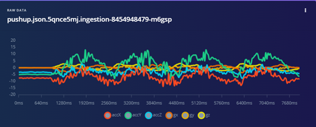
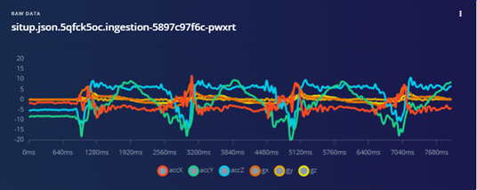
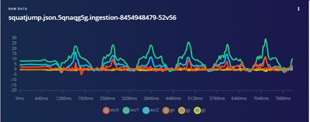
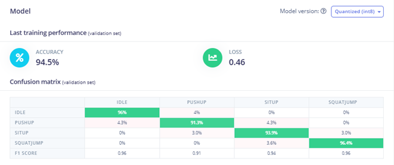
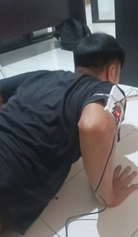
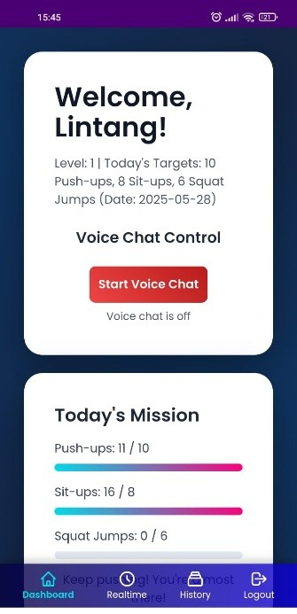
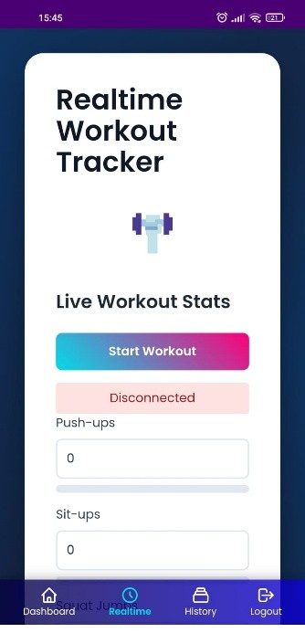
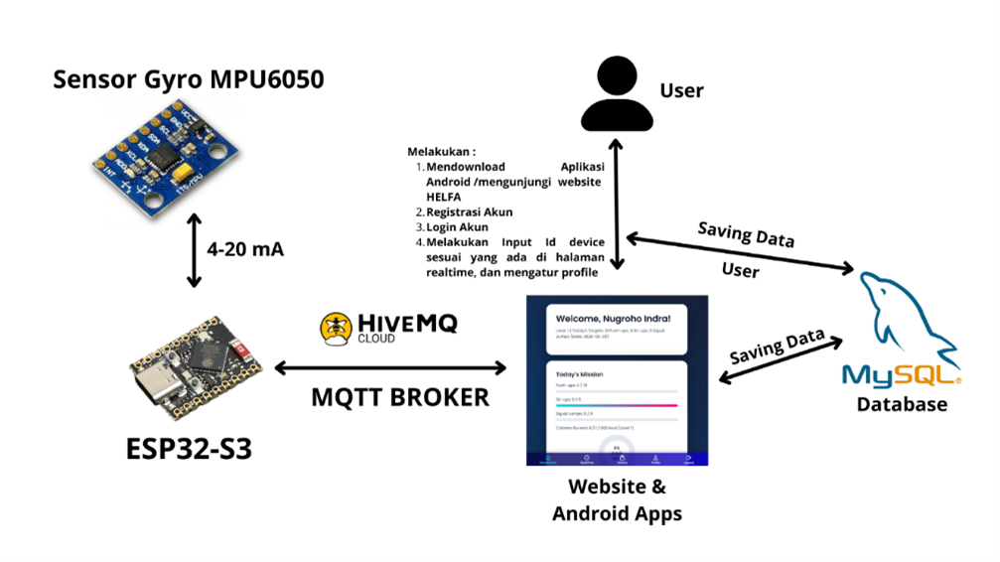

# SMARTFIT: Smart Wearable for Fitness Training

**SMARTFIT** adalah inovasi gelang pintar berbasis AIoT yang dirancang untuk mendukung transformasi digital dalam kebugaran tubuh. Sistem ini memanfaatkan kombinasi sensor akselerometer, mikrokontroler, Artificial Neural Network (ANN), serta integrasi dengan aplikasi mobile dan website untuk mengenali gerakan olahraga seperti push-up, sit-up, dan squat jump secara real-time.

## 📱 Fitur Utama

- **Workout Detection**: Deteksi otomatis jenis olahraga (push-up, sit-up, squat jump).
- **Realtime Feedback**: Hitung jumlah repetisi, kualitas gerakan, dan koreksi teknik secara langsung.
- **Personalized Goals**: Tantangan harian berdasarkan tinggi, berat, dan gender pengguna.
- **Calories Burned Calculator**: Estimasi kalori berdasarkan profil pengguna dan aktivitas.
- **Workout History**: Lacak progres mingguan dan bulanan.
- **Notifikasi Ringan**: Motivasi olahraga dan saran harian.
- **Cross-Platform**: Tersedia dalam bentuk aplikasi mobile & dashboard berbasis web.

## 🔧 Teknologi yang Digunakan

## 📷 Ilustrasi Desain

### 🎨 3D Desain Gelang SMARTFIT

Desain ergonomis berukuran 5 x 4.5 cm yang dapat dipasang di lengan untuk kenyamanan pengguna saat berolahraga.

- **Hardware**:
  - ESP32-S3 Mini
  - MPU6050 Accelerometer
  - Baterai LiPo 3.7V 250mAh
  - Step-up Converter 5V

### ⚡ Wiring Diagram Sistem Elektrikal

- **Software**:
  - Bahasa Pemrograman: Arduino C++ (embedded), JavaScript (web)
  - UI/UX: Tailwind CSS, GSAP
  - Komunikasi: MQTT (HiveMQ Broker)
  - Platform AI: Edge Impulse
  - Database: MySQL
  - Deployment: WebViewer (mobile app)

## 🧠 Model AI (Artificial Neural Network)

- Input: Data akselerometer (X, Y, Z) sampling 50 Hz selama 8 detik.
- Arsitektur:
  - 3 Hidden Layer: 32, 64, dan 128 neuron
  - Flatten Layer + Dropout
  - Output: 4 kelas aktivitas (idle, push-up, sit-up, squat jump)
- Akurasi: **94.5%** (hasil pelatihan di Edge Impulse)

### 📊 Hasil Training Model ANN

Push-Up :  

Sit-Up :  

Squat-Jump:  

Tingkat Akurasi :  

Model artificial neural network menghasilkan **akurasi sebesar 94.5%** dalam mengenali aktivitas fisik dari data akselerometer yang dikumpulkan melalui Edge Impulse.

### 📊 Bukti Pengambilan Data

Foto Pengambilan Data :  

## 🖥️ Dashboard Monitoring

Tampilan dashboard interaktif menyajikan:
- Jenis latihan yang terdeteksi
- Jumlah repetisi
- Performa mingguan
- Statistik pengguna

Foto Dashboard Monitoring :  

## 🌍 Arsitektur IoT

## 🌍 Dampak Sosial

- Meningkatkan kualitas kebugaran masyarakat secara digital
- Mendukung gaya hidup sehat berbasis teknologi
- Potensi integrasi dalam program pemerintah seperti Makan Bergizi Gratis (MBG)
- Dapat digunakan di rumah, gym, sekolah, hingga fasilitas kesehatan

## 👥 Tim Pengembang

- Nugroho Indra Kurniawan – 2042221031
- Lintang Herinda Kosesar – 2042221017
- Ahmad Fairuz Zaki Widyatna – 2042221061
- Alan Darmawan Dewantoro – 2042221020
> Institut Teknologi Sepuluh Nopember, Surabaya – 2025

## 📎 Lampiran
- Total biaya prototype: ±Rp329.900

---

**SMARTFIT** bukan hanya alat pemantau kebugaran, tapi juga pelatih pribadi digital yang adaptif dan cerdas.
